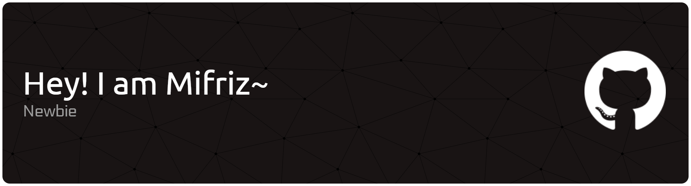

## Hello World!

- 🏫 I’m currently Student at State University of Medan
- 🌱 I’m currently learning C++
- 🍜 Noodle lovers

#### Skills
 
 
 

#### Device & Tool's

# 📊 GitHub Stats:
 
 

### ✍️ Random Dev Quote

---

